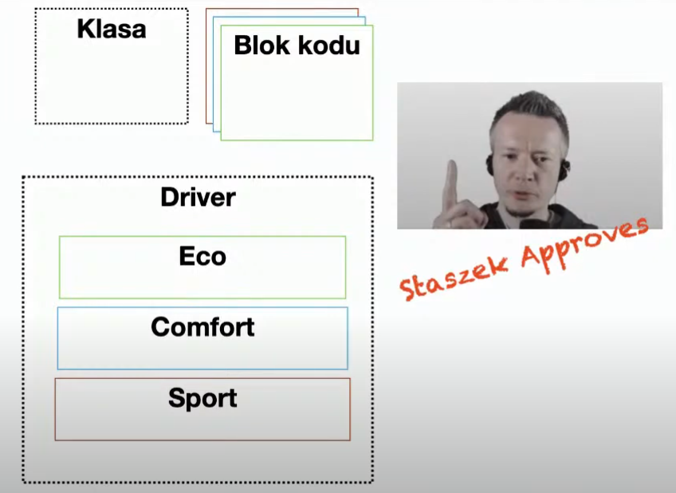
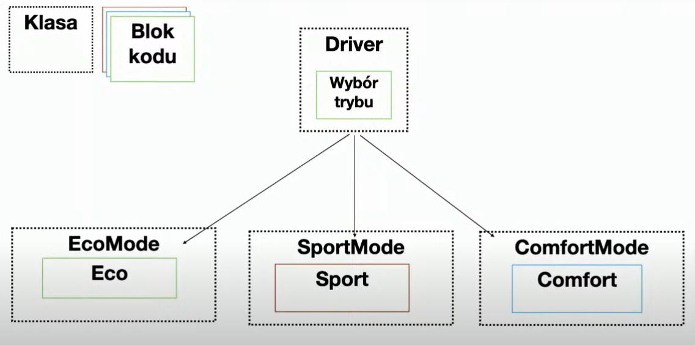
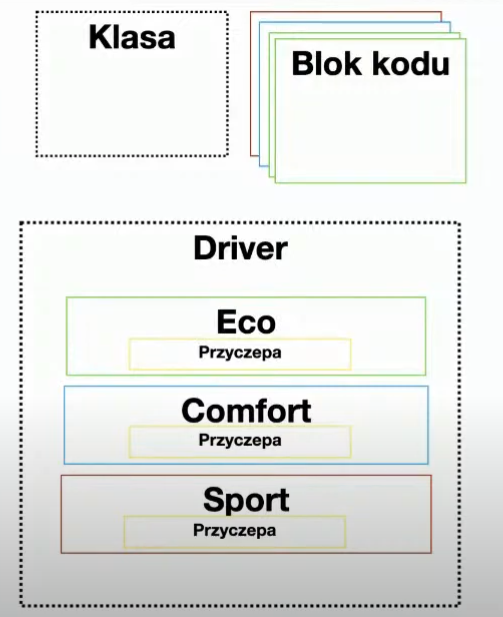
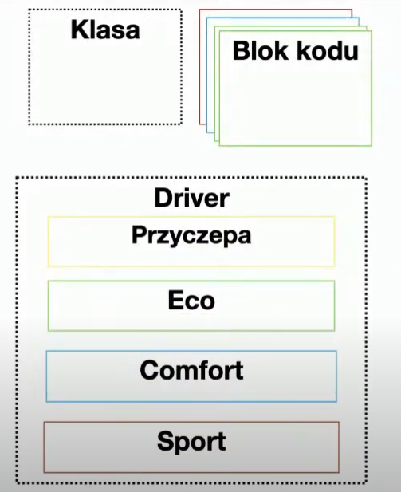

# Value object

The simplest operations we can perform on bad code are searching for value objects.

# Web sequence flow as a better way to describe a project

[link](https://www.websequencediagrams.com/app)

# Architecture proposed by participant #1

# Architecture proposed by participant #2

# Architecture proposed by participant #3

# Architecture proposed by participant #4

# Architecture proposed by participant #5

# How to identify abstractions?

Use the bottom-up method!

# Layered architecture

In the industry, the division into view, controller, and database is commonly referred to as layered architecture. However, this is simply a specific case of layered architecture. Layered architecture, according to Kuba, is an architecture that divides abstractions, allowing communication between abstractions.

# Recommended reading

DDD by Eric Evans, chapter 16 -> 4 levels of the model.