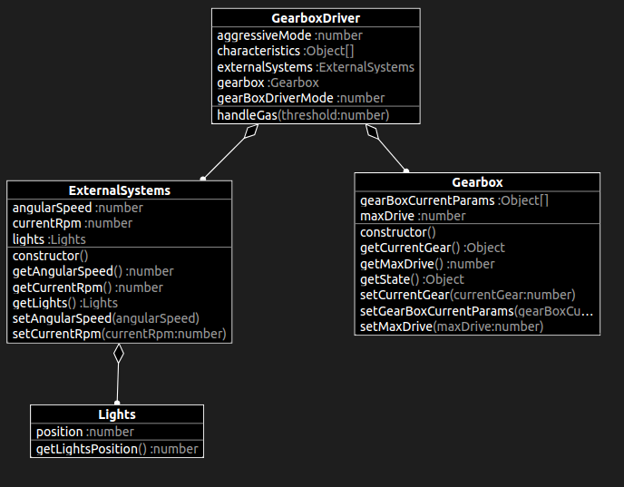

# Introduction

Presentation by Sławek and Kuba. General discussion on what we will be implementing. The first season starts with an initial implementation. In reality, seasons 1 and 2 should be switched in order; we should first go through season 2. How did it come to be that we have such a weak foundation on which season 1 is based?

# The class diagram for the project

