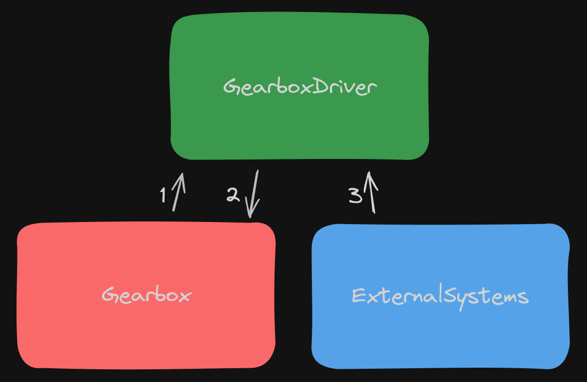
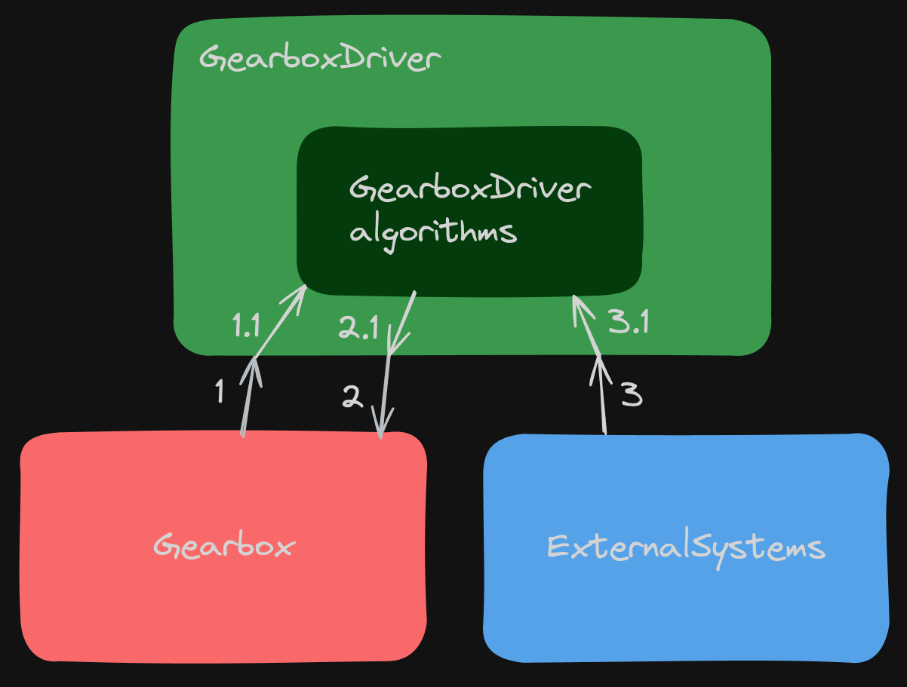

# When We Mock, Mock, and Mock Again
Generally, it can be overwhelmingly felt that testing is wrong when we repeatedly perform the entire ceremony of preparing mocks to test a simple thing. What does such a test verify if it has the implementation of mock, mock, mock, and mock again? If the testing library works well, we should only test the part of the functionality that interests us.

# Visualization



1. For this arrow. We ask a question. We perform a query. `GearboxDriver` makes a query to `Gearbox` for some information.
In the case of a query, we can ask someone 30 times about their age. Each time, we will get the same answer. The query does not change and does not affect the state of the `Gearbox` class.

2. For this arrow. We execute a command to change the state of the `Gearbox` class. We want to change the gear.

3. For this arrow. Just like for arrow number one. Here, we perform a simple query. Give me the position of the lights or give me the current state of the rotation unit of measure.

# Command–Query Separation
Command-query separation was created by Bertrand Meyer as part of his work on the Eiffel programming language. The main task of this approach is to define methods that can be assigned the characteristics of a query or a command. A command is often used nowadays in other architectural solutions, so for our purposes, we can say instead of command, a modifier. It more accurately conveys the meaning.

More information here:

[Command query separation - wiki](https://en.wikipedia.org/wiki/Command%E2%80%93query_separation)

[Martin Fowler blog post](https://martinfowler.com/bliki/CommandQuerySeparation.html)

## Query
This is a method that tries to obtain information from an object. It does not modify the object to which it directs its query. It simply expects the same value for each query to that object. A query does not modify the state of the object.

## Command (modifier)
This is a method that is required to change the state of a given object. Such a command does not return any value.

# Gear Shift Frequency
Later in the course, Sławek and Kuba will try to implement tracking the frequency of gear shifts.

# White-Box Test
In testing theory, such a test is considered a smell. A white-box test is characterized by very high "fragility". Every new implementation change causes the rewriting of tests.

# Black-Box Test
Since we are confronted with reality and white-box tests, how can we otherwise rewrite the given test into a black-box test? Where can we start?

# Approach to Changing a Test from White-Box to Black-Box
The header `given` gives me a car in some state. I hide this in one place. 150 tests can use this one method. When the way the car is prepared suddenly changes, we change the method implementation.

# What Does Our `GearboxDriver` Code Do?
1. It interacts with technical objects. With the `Gearbox` and `ExternalSystems` classes.
2. The `GearboxDriver` class has its own logic. That is, it has a set of ifs that affect the `Gearbox` class.

# Kuba's Suggestion
Extract the logic into a separate box and start testing only that box.



# Explanation of Terms Mock, Stub, Spy

## Test Double
Test double - when we want to replace some dependency in a class. In our example, if we are testing `GearboxDriver`, then a double would be, for example, `Gearbox`.

### Stub
A stub is taught to return some results to us.

Example from episode 1-3-1

```typescript
when(gearbox.getState()).thenReturn(1);
```

### Mock
We use a mock when some operations have been performed on an object. We examine the number of executions and so on.

## Types of Mocks
Mocks are divided into spies and mocks.

### Spy
This is a manually written mock. Often, a spy can intercept a signal from one object to another.

### Mock
We check how many times something was executed.

## Stub Division into Fake, Dummy, and Stub

# Rule of Thumb
If we have a command, I will definitely want to mock it. I will be interested in how many times it was executed? How many times did the gear change?

# Do Not Take Command-Query Separation Literally
It is not good when a command returns the state of an object, but it is good when it returns the result of an operation.

# Sometimes Mocking Queries Makes Sense
Mocking a query makes sense when we use an external API that costs money. Another reason is asking about processor resources.