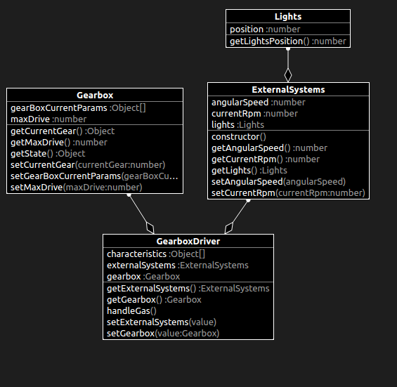

# What changed?

```diff
import { ExternalSystems } from "./ExternalSystems";
import { Gearbox } from "./Gearbox";

export class GearboxDriver {
  // prettier-ignore
  private characteristics: Object[] = [2000, 1000, 1000, 0.5, 2500, 4500, 1500, 0.5, 5000, 0.7, 5000, 5000, 1500, 2000, 3000, 6500];

+  private gearbox!: Gearbox;
+  private externalSystems!: ExternalSystems;
+
+  handleGas(): void {
+    if (<number>this.gearbox.getState() === 2) {
+      return;
+    }
+
+    if (<number>this.gearbox.getState() === 3) {
+      return;
+    }
+
+    if (<number>this.gearbox.getState() === 4) {
+      return;
+    }
+
+    let currentRpm: number = this.externalSystems.getCurrentRpm();
+    
+    if (currentRpm > <number>this.characteristics[0]) {
+      if (this.gearbox.getMaxDrive() >= <number>this.gearbox.getCurrentGear()) {
+        return;
+      }
+
+      this.gearbox.setCurrentGear(<number>this.gearbox.getCurrentGear() + 1);
+    }
+
+    if (currentRpm > <number>this.characteristics[1]) {
+      if (<number>this.gearbox.getCurrentGear() == 1) {
+        return;
+      }
+
+      this.gearbox.setCurrentGear(<number>this.gearbox.getCurrentGear() - 1);
+    }
+  }
+
+  public getGearbox(): Gearbox {
+    return this.gearbox;
+  }
+
+  public setGearbox(value: Gearbox) {
+    this.gearbox = value;
+  }
+
+  public getExternalSystems(): ExternalSystems {
+    return this.externalSystems;
+  }
+
+  public setExternalSystems(value: ExternalSystems) {
+    this.externalSystems = value;
+  }
}

```

# Class diagram

