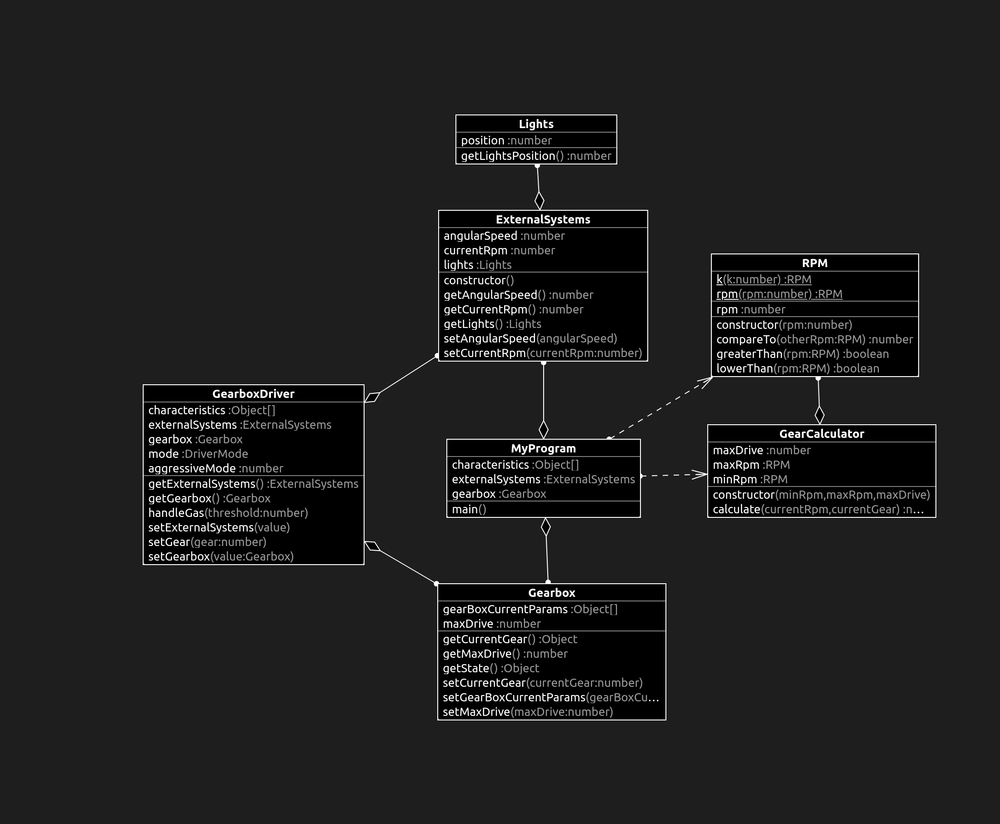

# What changed?

```diff
import { ExternalSystems } from "./ExternalSystems";
import { Gearbox } from "./Gearbox";
import { GearCalculator } from "./GearCalculator";
+import { RPM } from "./RPM";

class MyProgram {
  private readonly externalSystems: ExternalSystems = new ExternalSystems();
  // prettier-ignore
  private readonly characteristics: Object[] = [2000, 1000, 1000, 0.5, 2500, 4500, 1500, 0.5, 5000, 0.7, 5000, 5000, 1500, 2000, 3000, 6500];
  private readonly gearbox: Gearbox = new Gearbox();

  main(): void {
    const currentRpm: number = this.externalSystems.getCurrentRpm();
    const minRpm: number = <number>this.characteristics[1];
    const maxRpm: number = <number>this.characteristics[0];
    const currentGear: number = <number>this.gearbox.getCurrentGear();
    const maxDrive: number = this.gearbox.getMaxDrive();

    const gear: number = new GearCalculator(
+      RPM.rpm(minRpm),
+      RPM.rpm(maxRpm),
      maxDrive
+    ).calculate(RPM.rpm(currentRpm), currentGear);

    this.gearbox.setCurrentGear(gear);
  }
}

new MyProgram().main();

```

# RPM.ts

```diff
+export class RPM {
+  private rpm: number;
+
+  static k(k: number): RPM {
+    return RPM.rpm(k * 1000);
+  }
+
+  static rpm(rpm: number): RPM {
+    return new RPM(rpm);
+  }
+
+  constructor(rpm: number) {
+    if (rpm < 0) {
+      throw new Error(`Negative RPM: ${rpm}`);
+    }
+    this.rpm = rpm;
+  }
+
+  greaterThan(rpm: RPM): boolean {
+    return this.compareTo(rpm) > 0;
+  }
+
+  lowerThan(rpm: RPM): boolean {
+    return this.compareTo(rpm) < 0;
+  }
+
+  public compareTo(otherRpm: RPM): number {
+    if (this.rpm > otherRpm.rpm) {
+      return 1;
+    } else if (this.rpm < otherRpm.rpm) {
+      return -1;
+    } else {
+      return 0;
+    }
+  }
+}
```
# tests

## GearCalculator.test.ts

```diff
+import { GearCalculator } from "../src/GearCalculator";
+import { RPM } from "../src/RPM";
+
+describe("GearCalculatorTest", () => {
+  const calculator: GearCalculator = new GearCalculator(RPM.k(2), RPM.k(3), 8);
+
+  test("should shift up when above max RPM", () => {
+    // when
+    const nextGear: number = calculator.calculate(RPM.rpm(3300), 6);
+
+    // then
+    expect(nextGear).toBe(7);
+  });
+
+  test("should shift down when below min RPM", () => {
+    // when
+    const nextGear: number = calculator.calculate(RPM.rpm(1300), 6);
+
+    // then
+    expect(nextGear).toBe(5);
+  });
+
+  test("should do nothing within optimal RPM", () => {
+    // when
+    const nextGear: number = calculator.calculate(RPM.rpm(2300), 6);
+
+    // then
+    expect(nextGear).toBe(6);
+  });
+
+  test("should do nothing when max gear reached", () => {
+    // when
+    const nextGear: number = calculator.calculate(RPM.rpm(3300), 8);
+
+    // then
+    expect(nextGear).toBe(8);
+  });
+
+  test("should do nothing when minimal gear reached", () => {
+    // when
+    const nextGear: number = calculator.calculate(RPM.rpm(1300), 1);
+
+    // then
+    expect(nextGear).toBe(1);
+  });
+});

```
## RPM.test.ts

```diff
+import { RPM } from "../src/RPM";
+
+describe("RPM test", () => {
+  test("cannot have negative RPMs", () => {
+    expect(() => {
+      RPM.rpm(-2);
+    }).toThrow(new Error("Negative RPM: -2"));
+  });
+
+  test("kilos should be equals to units", () => {
+    expect(new RPM(2000)).toEqual(RPM.k(2));
+    expect(new RPM(2500)).toEqual(RPM.k(2.5));
+    expect(new RPM(2700)).toEqual(RPM.k(2.7));
+    expect(new RPM(500)).toEqual(RPM.k(0.5));
+    expect(new RPM(0)).toEqual(RPM.k(0));
+  });
+});

```

# class diagram

