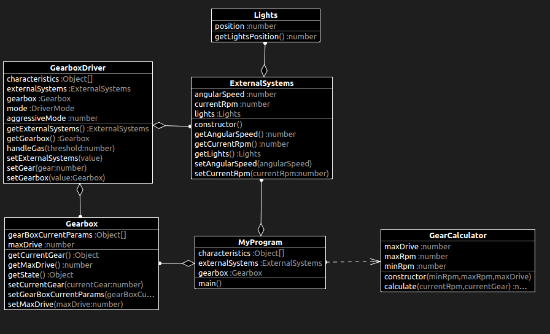

# What changed?

# main.ts

```diff
import { ExternalSystems } from "./ExternalSystems";
import { Gearbox } from "./Gearbox";
+import { GearCalculator } from "./GearCalculator";

class MyProgram {
  private readonly externalSystems: ExternalSystems = new ExternalSystems();
  // prettier-ignore
  private readonly characteristics: Object[] = [2000, 1000, 1000, 0.5, 2500, 4500, 1500, 0.5, 5000, 0.7, 5000, 5000, 1500, 2000, 3000, 6500];
  private readonly gearbox: Gearbox = new Gearbox();

  main(): void {
    const currentRpm: number = this.externalSystems.getCurrentRpm();
    const minRpm: number = <number>this.characteristics[1];
    const maxRpm: number = <number>this.characteristics[0];
    const currentGear: number = <number>this.gearbox.getCurrentGear();
    const maxDrive: number = this.gearbox.getMaxDrive();

+    const gear: number = new GearCalculator(minRpm, maxRpm, maxDrive).calculate(
+      currentRpm,
+      currentGear
+    );

    this.gearbox.setCurrentGear(gear);
  }
}

new MyProgram().main();

```

# GearCalculator.ts

```diff
+export class GearCalculator {
+  private minRpm: number;
+  private maxRpm: number;
+  private maxDrive: number;
+
+  constructor(minRpm: number, maxRpm: number, maxDrive: number) {
+    this.minRpm = minRpm;
+    this.maxRpm = maxRpm;
+    this.maxDrive = maxDrive;
+  }
+
+  public calculate(currentRpm: number, currentGear: number): number {
+    if (currentRpm > this.maxRpm) {
+      if (currentGear === this.maxDrive) {
+        return currentGear;
+      }
+      return currentGear + 1;
+    }
+
+    if (currentRpm < this.minRpm) {
+      if (currentGear === 1) {
+        return currentGear;
+      }
+      return currentGear - 1;
+    }
+
+    return currentGear;
+  }
+}
```

# class diagram

