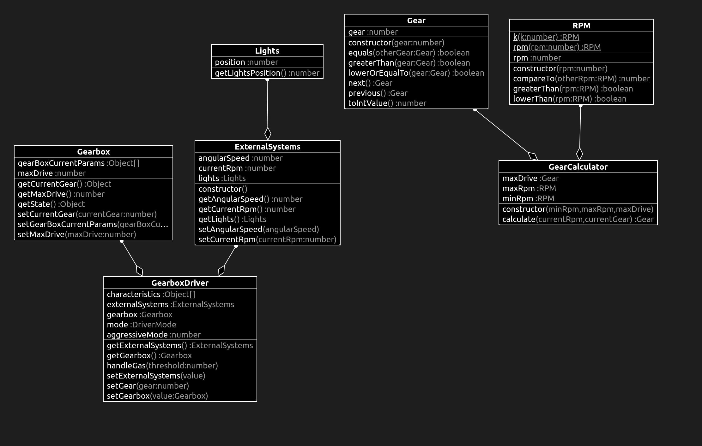

# What changed?

# Gear.ts

```diff
+export class Gear {
+    private gear: number;
+  
+    constructor(gear: number) {
+      if (gear < 0) {
+        throw new Error('Negative representation of gear');
+      }
+  
+      this.gear = gear;
+    }
+  
+    next(): Gear {
+      return new Gear(this.gear + 1);
+    }
+  
+    previous(): Gear {
+      return new Gear(this.gear - 1);
+    }
+  
+    equals(otherGear: Gear): boolean {
+      return this.gear === otherGear.gear;
+    }
+  
+    greaterThan(gear: Gear): boolean {
+      return this.gear > gear.gear;
+    }
+  
+    lowerOrEqualTo(gear: Gear): boolean {
+      return this.gear <= gear.gear;
+    }
+  
+    toIntValue(): number {
+      return this.gear;
+    }
+  }
  
```

# test

## Gear.test.ts

```diff
+import { Gear } from "../src/Gear";+

+describe('GearTest', () => {
+    test('cannot have gear with negative representation', () => {
+      expect(() => {
+        new Gear(-2);
+      }).toThrow(new Error('Negative representation of gear'));
+    });
+  
+    test('should create next gear', () => {
+      expect(new Gear(5)).toEqual(new Gear(4).next());
+      expect(new Gear(3)).toEqual(new Gear(2).next());
+      expect(new Gear(2)).toEqual(new Gear(1).next());
+    });
+  
+    test('should create previous gear', () => {
+      expect(new Gear(5)).toEqual(new Gear(6).previous());
+      expect(new Gear(3)).toEqual(new Gear(4).previous());
+      expect(new Gear(2)).toEqual(new Gear(3).previous());
+    });
+  
+    test('should be greater than given gear', () => {
+      expect(new Gear(2).greaterThan(new Gear(1))).toEqual(true);
+    });
+  
+    test('should be less or equal to given gear', () => {
+      expect(new Gear(1).lowerOrEqualTo(new Gear(2))).toEqual(true);
+      expect(new Gear(1).lowerOrEqualTo(new Gear(1))).toEqual(true);
+    });
+  });
```

# class diagram

