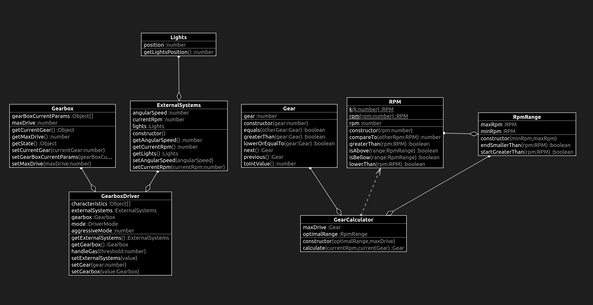

# What changed?

## RpmRange.ts

```diff
+import { RPM } from "./RPM";
+
+export class RpmRange {
+  private minRpm: RPM;
+  private maxRpm: RPM;
+
+  constructor(minRpm: RPM, maxRpm: RPM) {
+    if (minRpm.compareTo(maxRpm) > 0) {
+      throw new Error("Wrong RPMs");
+    }
+
+    this.minRpm = minRpm;
+    this.maxRpm = maxRpm;
+  }
+
+  startGreaterThan(rpm: RPM): boolean {
+    return this.minRpm.compareTo(rpm) > 0;
+  }
+
+  endSmallerThan(rpm: RPM): boolean {
+    return this.maxRpm.compareTo(rpm) < 0;
+  }
+}

```

# tests

## RpmRange.test.ts

```diff
+import { RPM } from "../src/RPM";
+import { RpmRange } from "../src/RpmRange";
+
+describe("Test RpmRange class", () => {
+  test("should create invalid range", () => {
+    expect(() => {
+      new RpmRange(RPM.k(5), RPM.k(3));
+    }).toThrow(new Error("Wrong RPMs"));
+  });
+
+  test("should create valid range", () => {
+    expect(() => {
+      new RpmRange(RPM.k(3), RPM.k(5));
+    }).not.toThrow(new Error("Wrong RPMs"));
+  });
+});

```

# class diagram

