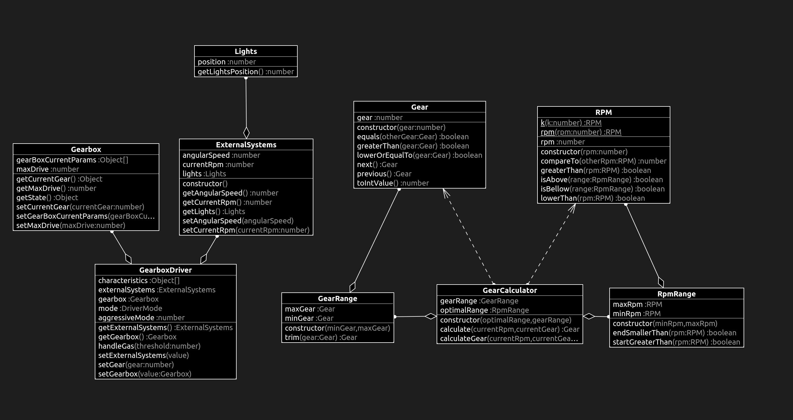

# What changed?

# GearRange.ts

```diff
+import { Gear } from "./Gear";
+
+export class GearRange {
+  private minGear: Gear;
+  private maxGear: Gear;
+
+  constructor(minGear: Gear, maxGear: Gear) {
+    if (minGear.greaterThan(maxGear)) {
+      throw new Error("Invalid gear range");
+    }
+
+    this.minGear = minGear;
+    this.maxGear = maxGear;
+  }
+
+  trim(gear: Gear) {
+    if (gear.greaterThan(this.maxGear)) {
+      return this.maxGear;
+    } else if (gear.lowerOrEqualTo(this.minGear)) {
+      return this.minGear;
+    } else {
+      return gear;
+    }
+  }
+}

```
# tests

## GearRange.test.ts

```diff
+import { Gear } from "../src/Gear";
+import { GearRange } from "../src/GearRange";
+
+describe("GearRangeTest", () => {
+  const oneToEight: GearRange = new GearRange(new Gear(1), new Gear(8));
+
+  test("cannot create invalid range", () => {
+    expect(() => {
+      new GearRange(new Gear(2), new Gear(1));
+    }).toThrow(new Error("Invalid gear range"));
+  });
+
+  test("should trim when too high gear", () => {
+    expect(new Gear(8)).toEqual(oneToEight.trim(new Gear(8)));
+  });
+
+  test("should trim when too low gear", () => {
+    expect(new Gear(1)).toEqual(oneToEight.trim(new Gear(0)));
+  });
+});

```

# class diagram

