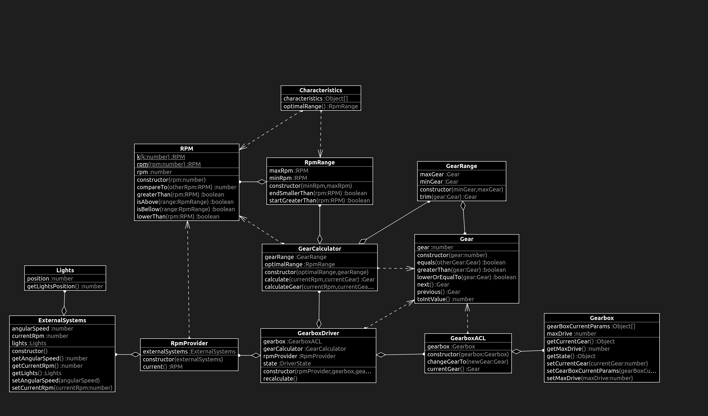

# What changed?

## Characteristics.ts

```diff
+import { RPM } from "./RPM";
+import { RpmRange } from "./RpmRange";
+
+export class Characteristics {
+  private characteristics: Object[] = [
+    2000, 1000, 1000, 0.5, 2500, 4500, 1500, 0.5, 5000, 0.7, 5000, 5000, 1500,
+    2000, 3000, 6500,
+  ];
+
+  optimalRange() {
+    return new RpmRange(
+      RPM.k(<number>this.characteristics[1]),
+      RPM.k(<number>this.characteristics[4])
+    );
+  }
+}

```

## GearboxACL.ts

```diff
+import { Gear } from "./Gear";
+import { Gearbox } from "./Gearbox";
+
+export class GearboxACL {
+  private gearbox: Gearbox;
+
+  constructor(gearbox: Gearbox) {
+    this.gearbox = gearbox;
+  }
+
+  changeGearTo(newGear: Gear): void {
+    this.gearbox.setCurrentGear(newGear.toIntValue());
+  }
+
+  currentGear(): Gear {
+    return new Gear(<number>this.gearbox.getCurrentGear());
+  }
+}

```
## GearboxDriver.ts

``` diff
+import { Gear } from "./Gear";
+import { GearboxACL } from "./GearboxACL";
+import { GearCalculator } from "./GearCalculator";
+import { RpmProvider } from "./RpmProvider";
+
+enum DriverState {
+  Reverse,
+  Neutral,
+  Park,
+  Drive,
+}
+
+export class GearboxDriver {
+  private rpmProvider: RpmProvider;
+  private gearbox: GearboxACL;
+  private gearCalculator: GearCalculator;
+  private state: DriverState = DriverState.Park;
+
+  constructor(
+    rpmProvider: RpmProvider,
+    gearbox: GearboxACL,
+    gearCalculator: GearCalculator
+  ) {
+    this.rpmProvider = rpmProvider;
+    this.gearbox = gearbox;
+    this.gearCalculator = gearCalculator;
+  }
+
+  recalculate(): void {
+    if ((this.state = DriverState.Drive)) {
+      const newGear: Gear = this.gearCalculator.calculateGear(
+        this.rpmProvider.current(),
+        this.gearbox.currentGear()
+      );
+      this.gearbox.changeGearTo(newGear);
+    }
+  }
+}

```
## RpmProvider.ts

```diff
+import { ExternalSystems } from "./ExternalSystems";
+import { RPM } from "./RPM";
+
+export class RpmProvider {
+  private externalSystems: ExternalSystems;
+
+  constructor(externalSystems: ExternalSystems) {
+    this.externalSystems = externalSystems;
+  }
+
+  current(): RPM {
+    return RPM.k(this.externalSystems.getCurrentRpm());
+  }
+}

```

# tests

# class diagram

