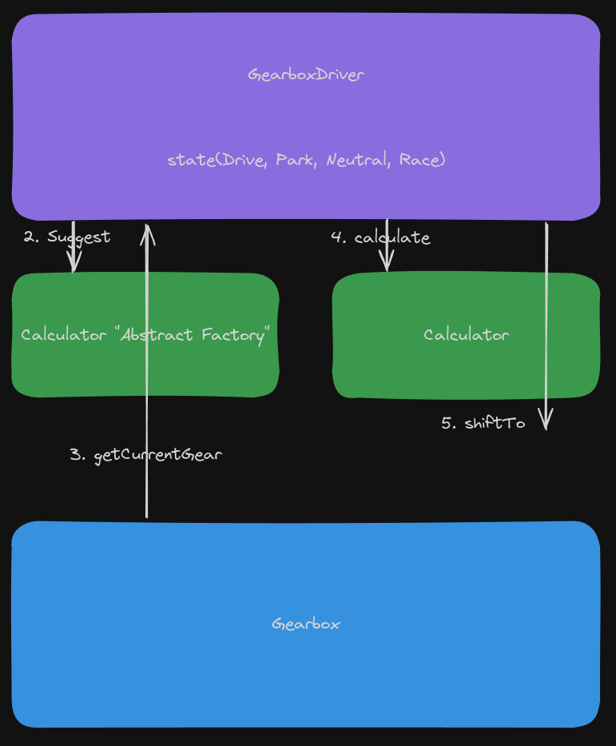

# Architectural Diagram Discussion

# GearboxDriver

The GearboxDriver class will be responsible solely for the state of the entire car as a machine. Whether the car is moving forward, backward, or is in neutral. One of the proposed patterns is to use the State pattern.

# Calculator

The gear calculation itself has been moved to the Calculator class. Over time, the Calculator class will likely become an interface, and there will be many different calculators.

# Calculators "Abstract Factory"

The `Calculators` class is responsible for suggesting the appropriate calculator. The `Calculators` class returns a calculator depending on the modes. For the BMW M2 Competition, the `Calculators` class does not have the `Eco`, `Comfort` modes. The BMW M2 Competition has modes: `Efficient`, `Sport`, and `Sport+`. Currently, the values `Eco`, `Comfort`, and `Sport` are hard-coded. Different cars have different modes.

# MDynamics mode and trailer

Some cars have these functionalities, some do not. The architecture will be transformed in such a way that these things are added optionally.

# Architecture Diagram

