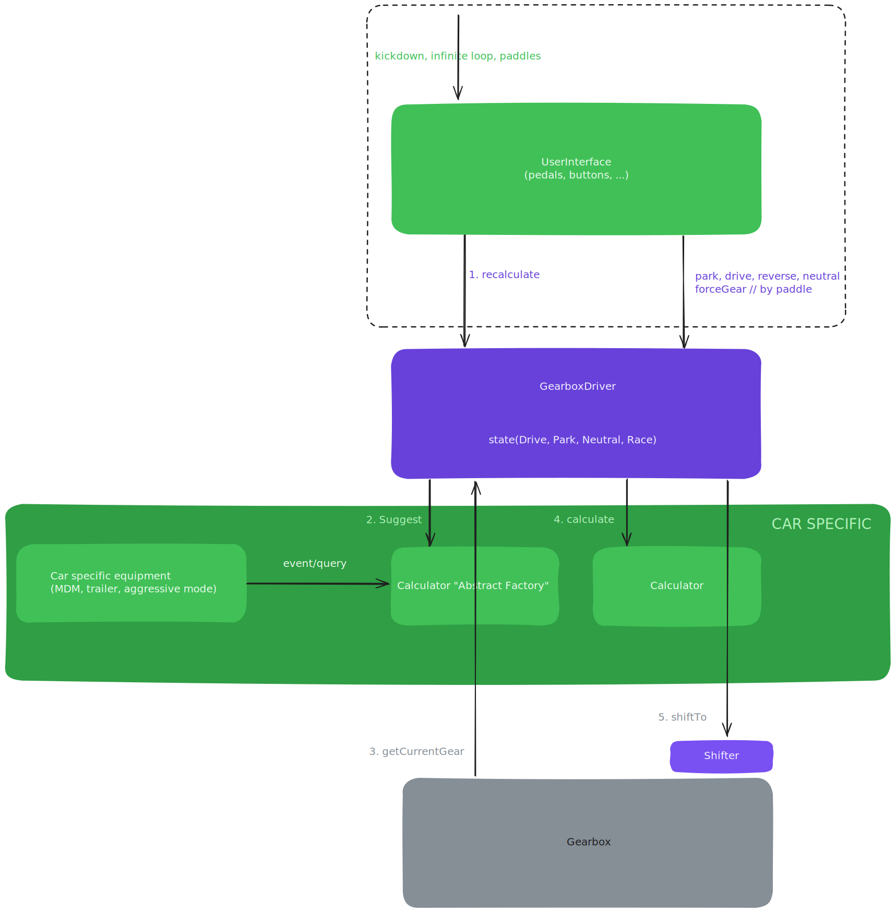

# Difference in Thinking Approaches Leading to a Different Architectural Approach

# Nassi–Shneiderman Diagram

This is how the code is seen through the eyes of the person who implemented the first version of the solution.

[Nassi–Shneiderman diagram](https://en.wikipedia.org/wiki/Nassi%E2%80%93Shneiderman_diagram)

# Architectural Diagram

Elements specific to a given car and a given gearbox are provided "from the side" to the `Calculators` class. What is in green is specific to a particular car. What is in purple is universal, meaning that every car has states.

